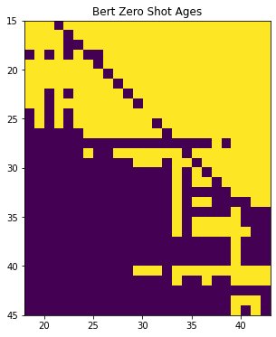

#oLMpics Replication

I attempt to recreate sections of [oLMpics - On what Language Model Pre-training Captures](https://arxiv.org/pdf/1912.13283.pdf) by Alon Talmor, Yanai Elazarm Yoav Goldberg, and Jonathan Berant. 

The work examines a series of eight reasoning tasks to better understand wether language models are capable of symbolic reasoning. The authors attempt to differentiate between knowledge gained from pre-training opposed to language encoded during fine tuning by including learning curves over fine tuning samples and a variety of controls.

I focus on one of the included datasets for [Age-Comparison](https://olmpics.s3.us-east-2.amazonaws.com/challenge/number_comparison/number_comparison_age_compare_masked_train.jsonl.gz). Using [Pytorch](https://github.com/pytorch/pytorch) and huggingface's [Transformers](https://github.com/huggingface/transformers) library for implementation. I focus on the Multiple-Choice masked Language Model (MC-MLM) and the Multiple-Choice Question Answering Model (MC-QA). I include the Zero Shot comparison the authors use as a control and I produce learning curves similar to those presented in the paper.

## Zero Shot

In the images above BERT (`bert-large-uncased-whole-word-masking`) and RoBERTa (`roberta-large`) performance without pre-training is compared to the results from the paper. The results appear to capture more or less similar patterns. The specific differences in my roberta model vs the authors is not immediatly apparent to me.

## Multi-choice Masked Language Model (MC-MLM)

I implement models for both BERT and RoBERTa as described in section 2.2 of the paper. For a sequence of words with a single masked token. The repressentation of the `[MASK]` token is passed to the 1 hidden layer Multi-Layer Perceptron head where we take the softmax of all the choices from the set. In this case over `older` and  `younger`. 

## Multi-choice Question Answering (MC-QA) 

Using a question answering setup we attempt to fine tune for "[CLS] **q** [SEP] a*k*" for answers *k*  in our choices. This model cannot be used without fine tuning compared to MC-MLM. The authors specify that MC-MLM is ", used for tasks where the answer-set is small, consistent across the different questions, and each answer appears as a single item in the word-piece vocabulary" which largely reflects the age comparison dataset. I'm not sure if it was for that reason or other issues in implementation but I was unable to obtain results greater than change with this setup on the age comparison data.

## Learning Curves

|      |   bert-base-uncased |   bert-large-uncased |   bert-large-uncased-whole-word-masking |   roberta-base |   roberta-large |
|-----:|--------------------:|---------------------:|----------------------------------------:|---------------:|----------------:|
|    0 |                49.4 |                 50.6 |                                    76.6 |           49.4 |            49.4 |
|   60 |                46.2 |                 50.6 |                                    53.2 |           49.4 |            98   |
|  120 |                46.4 |                 50.6 |                                    92   |           52.6 |           100   |
|  250 |                49.4 |                 75.4 |                                    60   |           59.2 |            99.8 |
|  500 |                49.4 |                 50.6 |                                    94   |           88.6 |           100   |
| 1000 |                49.4 |                 60   |                                    97.2 |           58.8 |           100   |
| 2000 |                49   |                 61   |                                   100   |           75   |           100   |
| 4000 |                44.2 |                 81.6 |                                   100   |           97.6 |           100   |

The results shown here are nearly identical to those presented in the paper (they do some averaging across runs). RoBERTa-Large shows the highest starting success at the task and BERT-whole-word-masking slightly further behind.

## No Lang

No lang attempts to evaluate the models with no language information. 
`"A 15 year old person age is [MASK] than a 20 year old person ."` becomes
`"15 [MASK] 20"`. The idea of this control is that if a model succeeds under these circumstances it is relying on the what was learned during fine tuning rather than from the original pre-trained language model. In my replication the results are quite different from those in the original paper. I'm wondering if the authors fine tuned on no-lang examples rather than the training set that was used for other experiments?